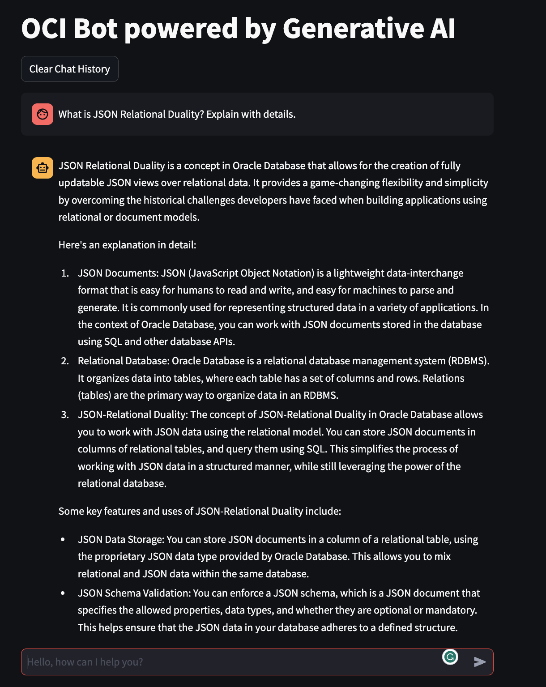

# Knowledge Assistant with LangChain

Here you'll find all the code to develop a RAG Knowledge Assistant

## The UI of the **Knowledge Assistant** you can build using following examples.

## Features
* Retrieval Augmented Generation (RAG)
* Manage the chat history
* List of references
* Support Cohere Embeddings and LLM (comand-r...)
* Support **OCI Generative AI** Service
* Support for local **FAISS** Vector Store
* (30/04/2024) added **OpenSearch** as Vector Store

